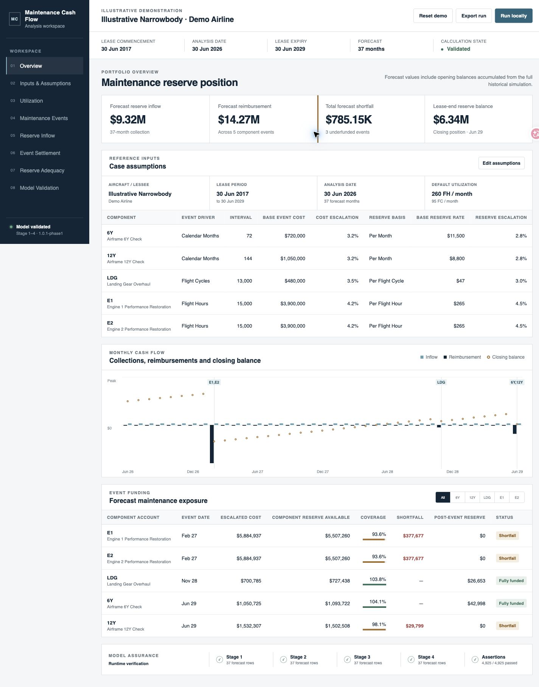
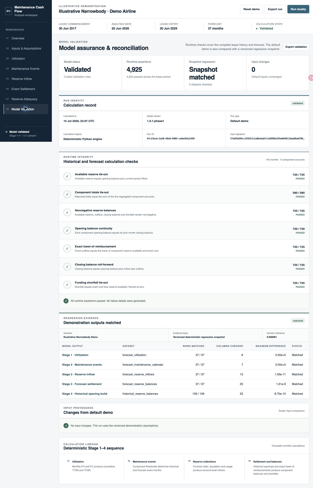

# Aircraft Maintenance Reserve Cash Flow

A deterministic Python model and local dashboard for forecasting aircraft utilization, maintenance events, maintenance reserve collections, reimbursements, component balances and funding shortfalls.

[Open the hosted dashboard](https://phaywang.github.io/aircraft-maintenance-reserve-model/) — the GitHub Pages version is a read-only demonstration; clone the repository to recalculate edited scenarios.

[Open the V2 lifecycle comparison](https://phaywang.github.io/aircraft-maintenance-reserve-model/v2/) — compares arbitrary-duration follow-on leases on one common valuation horizon.



## What the model does

The model calculates a complete monthly history from manufacture through lease expiry and exposes the forecast from the selected analysis date.

1. **Utilization** — monthly flight hours and cycles roll into TTSN and TCSN.
2. **Maintenance events** — calendar, flight-hour and flight-cycle thresholds determine event months.
3. **Reserve collections** — component rates, charging bases and escalation produce monthly inflows.
4. **Settlement** — each event is reimbursed by the lower of its qualifying cost and the matching component reserve available.
5. **Adequacy** — component-level balances and shortfalls identify funding exposure.

Reserve accounts remain segregated throughout the model. The expiry month is processed as an active contractual period: final utilization and reserve collections occur before maintenance settlement and account close-out.

## Dashboards

The local dashboard provides editable inputs and eight analysis views:

- Overview
- Inputs & Assumptions
- Utilization
- Maintenance Events
- Reserve Inflow
- Event Settlement
- Reserve Adequacy
- Model Validation

The V2 lifecycle workspace adds seven views for complete follow-on lease decisions:

- Decision Summary
- Alternatives
- Utilization
- Events & Settlement
- Cash Flow & Valuation
- Sensitivity
- Model Audit



## Demonstration assumptions

The included narrowbody scenario is fully illustrative and is not a market benchmark. It uses:

- manufacture and lease commencement: 30 June 2017;
- analysis date: 30 June 2026;
- lease expiry: 30 June 2029;
- monthly utilization: 260 flight hours and 95 flight cycles;
- five tracked accounts: 6Y, 12Y, landing gear, engine 1 and engine 2.

All dates, utilization, costs, reserve rates and escalation assumptions can be edited in the dashboard.

The synthetic reserve rates are calibrated to demonstrate different funding outcomes: fully funded events, a near-threshold event and material component shortfalls. They are illustrative inputs, not market quotations.

## Run locally

Python 3.11 or newer is required.

```bash
python3 -m venv .venv
source .venv/bin/activate
pip install -e .
python3 scripts/run_dashboard_api.py --port 8765
```

Open [http://127.0.0.1:8765](http://127.0.0.1:8765).

Open [http://127.0.0.1:8765/v2/](http://127.0.0.1:8765/v2/) for the multi-lease lifecycle comparison.

On macOS, `Run Aircraft Reserve Dashboard.command` starts the same local service.

## Command-line outputs

```bash
python3 scripts/run_case.py --step 1
python3 scripts/run_case.py --step 2
python3 scripts/run_case.py --step 3
python3 scripts/run_case.py --step 4
```

CSV outputs are written to `outputs/`.

## Validation

The model runs 4,925 runtime assertions across 145 lease-period months and five component accounts. The default scenario is also checked against a versioned regression snapshot covering 257 calculation rows.

Run the test suite:

```bash
PYTHONPATH=src python3 -m unittest discover -s tests -v
```

The tests cover threshold crossing, calendar-versus-usage event behavior, rate escalation, component segregation, lower-of reimbursement, balance continuity, expiry-period reserve collection and JSON/API contracts.

## Project structure

```text
src/aircraft_cashflow/   Calculation engine and local API
dashboard/static/        Dashboard application
dashboard/v2/            V2 lessor lifecycle scenario builder
tests/                   Unit, regression and interface tests
scripts/                 CLI and payload utilities
docs/v2/                 GitHub Pages V2 application
docs/images/             Dashboard screenshots
```

## V2 lifecycle model

Version 2.1 keeps V1 unchanged and provides an independent lessor lifecycle scenario builder. One scenario can start at an arbitrary analysis date and contain a current lease, any number of future leases, and explicit transition or storage periods. Physical component state continues across leases while contract reserve accounts close separately. The primary output is nominal rent, maintenance-reserve, reimbursement, lessee-unfunded, redelivery and transition cash flow; multi-scenario comparison is optional and is not based on a mandatory NPV ranking.

## License

MIT License. See [LICENSE](LICENSE).
