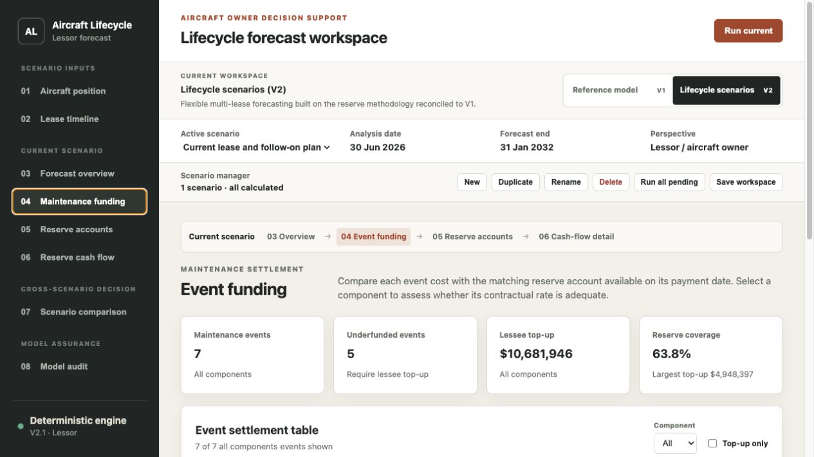

# Aircraft Maintenance Reserve Lifecycle Model

A deterministic Python forecasting system for aircraft utilization, maintenance
events, maintenance reserve collections, reimbursements, component balances and
funding exposure. The project deliberately retains two workspaces: V1 is the
verified single-lease reference model, while V2 extends the same reserve
methodology to flexible multi-lease lifecycle scenarios.

## Choose a workspace

| Workspace | Purpose | Best for | Hosted dashboard |
|---|---|---|---|
| **Reference model (V1)** | Verified monthly single-lease model with a complete calculation audit trail | Reviewing the methodology, assumptions and component-level roll-forward | [Open V1](https://phaywang.github.io/aircraft-maintenance-reserve-model/) |
| **Lifecycle scenarios (V2)** | Flexible analysis-date and multi-lease forecasting for a lessor or aircraft owner | Building future lease paths and assessing maintenance funding exposure | [Open V2](https://phaywang.github.io/aircraft-maintenance-reserve-model/v2/) |

V2 does not replace V1. A V2 scenario containing only the reference lease is
reconciled to the V1 opening position, event funding, reserve-account
roll-forward and monthly component cash flow. Both hosted workspaces are
read-only demonstrations; clone the repository to recalculate edited inputs.


## What the model does

The model calculates a complete monthly history from manufacture through lease expiry and exposes the forecast from the selected analysis date.

1. **Utilization** — monthly flight hours and cycles roll into TTSN and TCSN.
2. **Maintenance events** — calendar, flight-hour and flight-cycle thresholds determine event months.
3. **Reserve collections** — component rates, charging bases and escalation produce monthly inflows.
4. **Settlement** — each event is reimbursed by the lower of its qualifying cost and the matching component reserve available.
5. **Adequacy** — component-level balances and shortfalls identify funding exposure.

Reserve accounts remain segregated throughout the model. The expiry month is processed as an active contractual period: final utilization and reserve collections occur before maintenance settlement and account close-out.

## Workspace design

V1 follows the original calculation sequence through eight views: overview,
inputs and assumptions, utilization, maintenance events, reserve inflow, event
settlement, reserve adequacy and model validation.

V2 uses the same reserve logic in a lifecycle workflow:

1. Aircraft position and editable maintenance program.
2. Any number of consecutive lease contracts and their utilization and reserve terms.
3. Current-scenario forecast overview, event funding, reserve accounts and detailed cash flow.
4. Optional comparison of any number of independently calculated scenarios.
5. Model audit and calculation provenance.

The physical aircraft state continues across lease boundaries. Each lease has
separate component reserve accounts, and the expiry period is processed in the
required order: final utilization, final reserve collection, maintenance-event
settlement and then account close-out.



## Demonstration assumptions

The included narrowbody scenario is fully illustrative and is not a market benchmark. It uses:

- aircraft / lessee: A320-200 operated by the fictional AeroVista Airlines;
- manufacture and lease commencement: 30 June 2017;
- analysis date: 30 June 2026;
- lease expiry: 30 June 2029;
- monthly utilization: 260 flight hours and 95 flight cycles;
- five tracked accounts: 6Y, 12Y, landing gear, engine 1 and engine 2.

All dates, utilization, costs, reserve rates and escalation assumptions can be edited in the dashboard.

The synthetic reserve rates are calibrated to demonstrate different funding outcomes: fully funded events, a near-threshold event and material component shortfalls. They are illustrative inputs, not market quotations.

The public timeline is shifted forward by 32 months from the private reference
case: manufacture, lease commencement, analysis and expiry move together, so
aircraft age, cumulative utilization and event timing relative to the lease are
preserved. Cost and reserve-rate escalation still resets each January. Because a
32-month shift changes where January falls within the relative lease timeline,
the monthly reserve collections and funding outcomes are recalculated and are
not expected to equal the private reference case.

The V2 public demo starts from the same aircraft and analysis-date position. It
then continues the existing lease through 30 June 2029 and adds a consecutive
follow-on lease with the fictional Northstar Air from 1 July 2029 through
31 January 2032. The follow-on path uses 250 FH and 95 FC per month and opens new
component reserve accounts using a 1.05 rate multiplier. These terms are chosen
to demonstrate the lifecycle workflow, not to represent a market quotation.

## Run locally

Python 3.11 or newer is required.

```bash
python3 -m venv .venv
source .venv/bin/activate
pip install -e .
python3 scripts/run_dashboard_api.py --port 8765
```

Open [V1 at http://127.0.0.1:8765](http://127.0.0.1:8765) or
[V2 at http://127.0.0.1:8765/v2/](http://127.0.0.1:8765/v2/). Both dashboards
also provide the same workspace switcher at the top of the page.

On macOS, `Run Aircraft Reserve Dashboard.command` starts the same local service.

## Command-line outputs

```bash
python3 scripts/run_case.py --step 1
python3 scripts/run_case.py --step 2
python3 scripts/run_case.py --step 3
python3 scripts/run_case.py --step 4
```

CSV outputs are written to `outputs/`.

## Validation

The model runs 4,925 runtime assertions across 145 lease-period months and five component accounts. The default scenario is also checked against a versioned regression snapshot covering 257 calculation rows.

Run the test suite:

```bash
PYTHONPATH=src python3 -m unittest discover -s tests -v
```

The tests cover threshold crossing, calendar-versus-usage event behavior, rate escalation, component segregation, lower-of reimbursement, balance continuity, expiry-period reserve collection and JSON/API contracts.

## Project structure

```text
src/aircraft_cashflow/   Calculation engine and local API
dashboard/static/        Dashboard application
dashboard/v2/            V2 lessor lifecycle scenario builder
tests/                   Unit, regression and interface tests
scripts/                 CLI and payload utilities
docs/v2/                 GitHub Pages V2 application
docs/images/             Dashboard screenshots
```

## V2 lifecycle model

Version 2.1 keeps V1 as the frozen reference baseline and provides an independent
lessor lifecycle scenario builder. V1 changes are limited to verified bug fixes;
V2 is the active product-development workspace. One V2 scenario can start at an
arbitrary analysis date and contain a current lease plus any number of
consecutive future leases. Physical component state continues across leases
while contract reserve accounts close separately.

The primary output covers maintenance-reserve collections, event cost, reserve
reimbursement, lessee top-up exposure and lease-end reserve close-out. Rent,
transition-period assumptions and whole-aircraft investment returns are outside
the active dashboard; multi-scenario comparison is optional and does not impose
an automatic ranking.

## License

MIT License. See [LICENSE](LICENSE).
