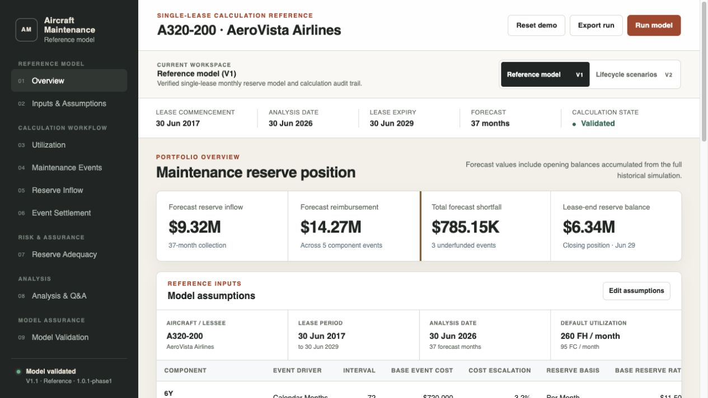
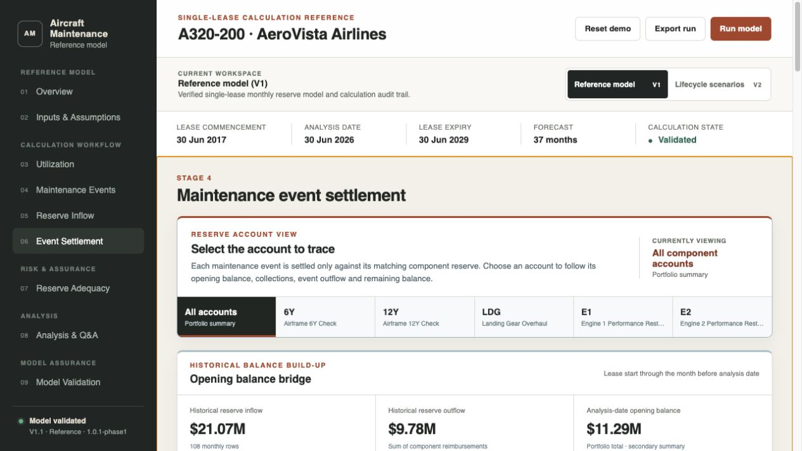
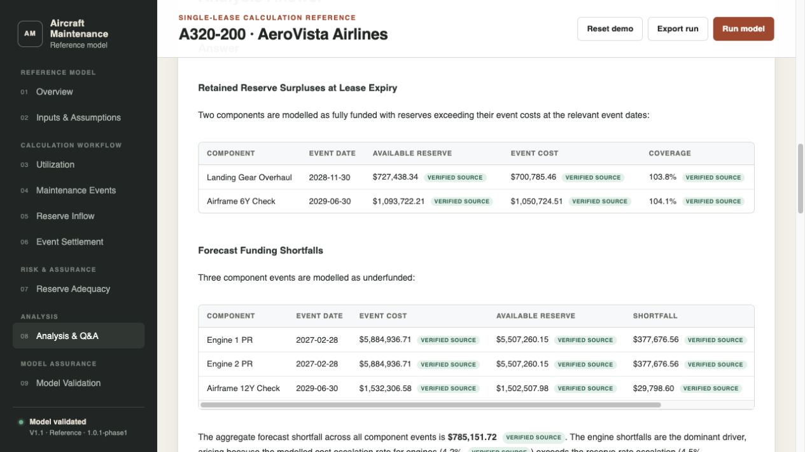
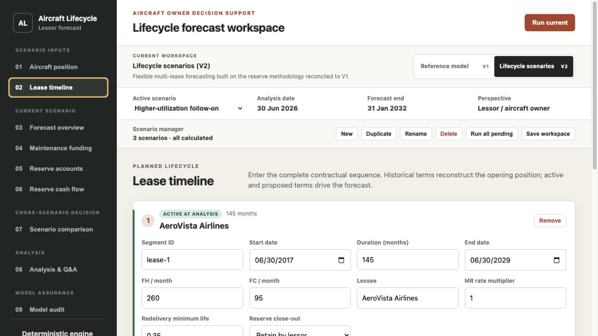
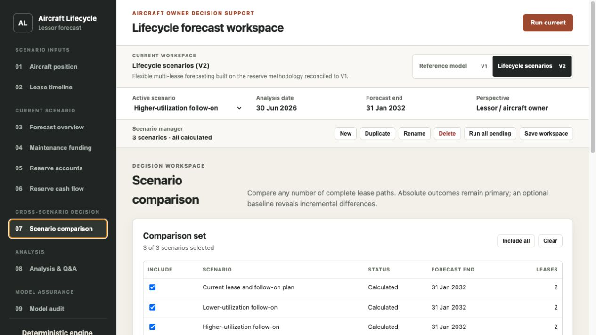
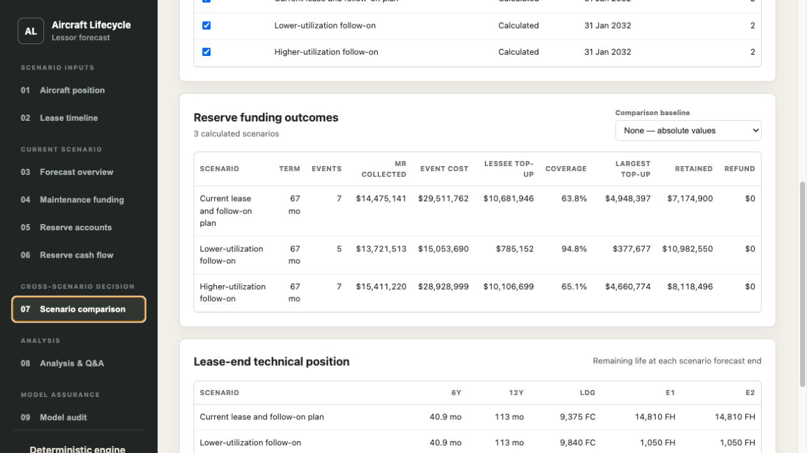
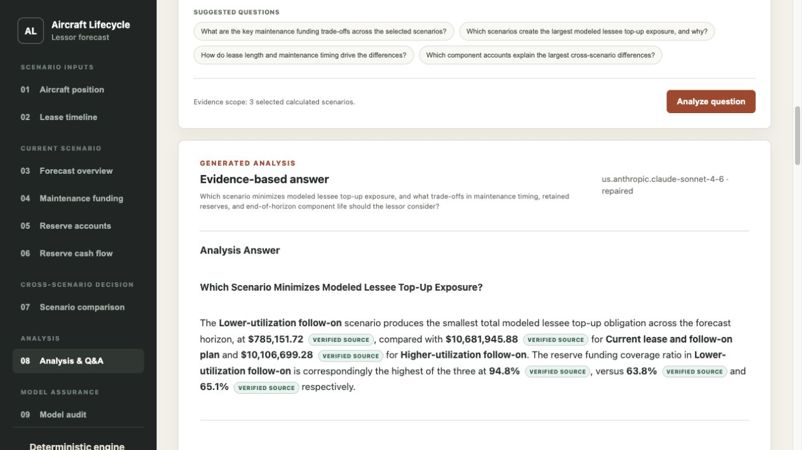

# Product Demo Workflow

This walkthrough presents the model from a lessor or aircraft-owner perspective. It starts with the reconciled single-lease reference model, then moves to multi-lease lifecycle scenarios and evidence-grounded Bedrock analysis.

All aircraft, airline and commercial assumptions shown here are fictional demonstration data. The model covers maintenance reserve funding only; it does not model base rent, aircraft market value, NPV, downtime or lessee credit quality.

## Recommended demo sequence

### Part 1 — Establish the calculation reference in V1

1. Open **Reference model (V1)** and use the Overview to introduce the aircraft, analysis date, lease expiry and headline reserve position.
2. Open **Inputs & Assumptions** to show that aircraft, utilization, maintenance program, costs and reserve terms are editable.
3. Walk through the deterministic sequence: **Utilization → Maintenance Events → Reserve Inflow → Event Settlement**.
4. In **Event Settlement**, emphasize that every maintenance event draws only from its matching component account and that the analysis-date opening balance is reconstructed from modeled history.
5. Use **Reserve Adequacy** to identify the component events requiring modeled lessee top-up.
6. Use **Model Validation** to show runtime assertions, regression evidence and calculation lineage.

### Part 2 — Demonstrate V1 analysis and free-form Q&A

1. Open **08 Analysis & Q&A**.
2. Generate a **Full Maintenance Reserve Analysis**.
3. Switch to **Ask a question** and enter a question that is not one of the suggested prompts:

> How should the lessor interpret the large lease-end retained reserve balance alongside the forecast engine funding shortfalls?

4. Explain that Bedrock interprets verified model claims but does not recalculate the cash flow. Every published currency amount and percentage is tied to a deterministic source claim.

### Part 3 — Build the lifecycle decision in V2

1. Switch to **Lifecycle scenarios (V2)**.
2. Review **Aircraft position** and the reconstructed analysis-date technical and reserve state.
3. Open **Lease timeline** and show the current lease followed immediately by a proposed lease. Technical usage continues across the boundary; the old lease accounts close and new component reserve accounts open.
4. Run the scenario and walk through **Forecast overview → Maintenance funding → Reserve accounts → Reserve cash flow**.
5. Duplicate the scenario twice and change only the proposed lease utilization:

| Scenario | Follow-on FH / month | Follow-on FC / month | Purpose |
|---|---:|---:|---|
| Current lease and follow-on plan | 250 | 95 | Base lifecycle path |
| Lower-utilization follow-on | 210 | 80 | Defers the second engine event beyond the horizon |
| Higher-utilization follow-on | 300 | 110 | Accelerates the second engine event |

6. Select all three scenarios and run every pending calculation.

### Part 4 — Compare multiple scenarios

Open **07 Scenario comparison** and explain the results in this order:

1. Absolute maintenance reserve outcomes and modeled lessee top-up.
2. Event count and timing.
3. Reserve funding coverage.
4. Reserve retained at close-out.
5. Remaining component life at the common forecast end.

The interface deliberately does not declare a universal “best” scenario. A lower in-horizon top-up can reflect a deferred maintenance event rather than an eliminated economic exposure.

### Part 5 — Generate a cross-scenario report and ask a custom question

1. Open **08 Analysis & Q&A**.
2. Select **Cross-Scenario Decision Report** and generate the report.
3. Switch to **Ask a question**, choose **Selected comparison set**, and enter:

> Which scenario minimizes modeled lessee top-up exposure, and what trade-offs in maintenance timing, retained reserves, and end-of-horizon component life should the lessor consider?

4. Wait for the answer to finish before presenting it. Use the verified-source badges to trace financial statements back to deterministic evidence.

## Complete screenshot set

The complete full-page capture set is retained for documentation and future README or presentation work.

### V1 reference workflow

| View | Screenshot |
|---|---|
| 01 Overview | [Open](assets/demo-v1/01-overview.png) |
| 02 Inputs & Assumptions | [Open](assets/demo-v1/02-inputs-assumptions.png) |
| 03 Utilization | [Open](assets/demo-v1/03-utilization.png) |
| 04 Maintenance Events | [Open](assets/demo-v1/04-maintenance-events.png) |
| 05 Reserve Inflow | [Open](assets/demo-v1/05-reserve-inflow.png) |
| 06 Event Settlement | [Open](assets/demo-v1/06-event-settlement.png) |
| 07 Reserve Adequacy | [Open](assets/demo-v1/07-reserve-adequacy.png) |
| 08 Generated report | [Open](assets/demo-v1/08a-full-analysis-report.png) |
| 08 Custom question | [Open](assets/demo-v1/08b-custom-question.png) |
| 09 Model Validation | [Open](assets/demo-v1/09-model-validation.png) |

### V2 lifecycle workflow

| View | Screenshot |
|---|---|
| 01 Aircraft position | [Open](assets/demo-v2/01-aircraft-position.png) |
| 02 Lease timeline | [Open](assets/demo-v2/02-lease-timeline.png) |
| 03 Forecast overview | [Open](assets/demo-v2/03-forecast-overview.png) |
| 04 Maintenance funding | [Open](assets/demo-v2/04-maintenance-funding.png) |
| 05 Reserve accounts | [Open](assets/demo-v2/05-reserve-accounts.png) |
| 06 Reserve cash flow | [Open](assets/demo-v2/06-reserve-cash-flow.png) |
| 07 Scenario comparison | [Open](assets/demo-v2/07-scenario-comparison.png) |
| 08 Cross-scenario report | [Open](assets/demo-v2/08a-cross-scenario-report.png) |
| 08 Custom cross-scenario question | [Open](assets/demo-v2/08b-cross-scenario-question.png) |
| 09 Model audit | [Open](assets/demo-v2/09-model-audit.png) |

## Suggested talk track

The shortest coherent product story is:

> V1 proves the monthly component-account methodology and reconciles the opening reserve position. V2 preserves that logic but allows the lessor to model consecutive leases and compare any number of lifecycle paths. The deterministic engine calculates every cash-flow result; Bedrock then turns those verified results into a report or a focused answer without inventing a second calculation layer.

